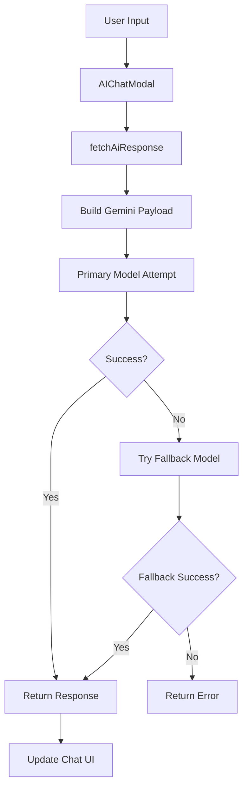
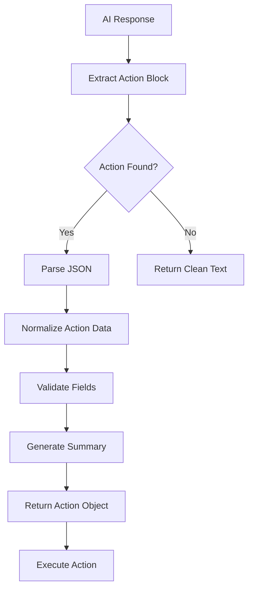

# Analisis Sistem AI Chat - SAPA AI Platform

## Overview

Sistem AI Chat dalam SAPA AI Platform adalah komponen canggih yang mengintegrasikan Google Gemini AI untuk menyediakan asisten cerdas yang membantu pengguna dalam analisis data anggaran dan manajemen kegiatan. Sistem ini dirancang dengan pendekatan context-aware conversation dan AI-powered form auto-fill untuk meningkatkan produktivitas pengguna.

## 1. Komponen AI Assistant Integration

### 1.1 AIChatModal Component
**File**: [`src/components/AIChatModal.tsx`](src/components/AIChatModal.tsx)

**Fitur Utama:**
- **Interface Chat Interaktif**: Modal chat dengan desain modern dan responsif
- **Message Management**: State management untuk percakapan dengan history tracking
- **Real-time Processing**: Indikator loading dan processing status
- **Error Handling**: Comprehensive error handling dengan fallback messages
- **Quick Prompts**: Tombol cepat untuk pertanyaan umum tentang data anggaran

**Struktur Komponen:**
```typescript
interface AIChatModalProps {
  onClose: () => void;
  onNewMessage: () => void;
  systemPrompt?: string;
}
```

**State Management:**
- `messages`: Array pesan dengan struktur `{id, sender, content, timestamp}`
- `isProcessing`: Status processing untuk UI feedback
- `error`: Error state untuk user notification

### 1.2 FloatingAIButton Component
**File**: [`src/components/FloatingAIButton.tsx`](src/components/FloatingAIButton.tsx)

**Fitur:**
- **Floating Action Button**: Tombol AI yang selalu accessible
- **Smooth Animations**: Hover effects dan transitions
- **Accessibility**: Proper ARIA labels dan keyboard navigation
- **Visual Design**: Icon chat dengan blue theme consistency

## 2. Google Gemini AI Integration

### 2.1 AI Service Architecture
**File**: [`services/aiService.ts`](services/aiService.ts)

**Model Configuration:**
- **Primary Model**: `models/gemini-2.5-flash` (default)
- **Fallback Models**: Support multiple model fallbacks via environment variables
- **API Base**: `https://generativelanguage.googleapis.com/v1beta`

**Environment Variables:**
```env
VITE_GEMINI_API_KEY=your-gemini-api-key
VITE_GEMINI_MODEL=models/gemini-2.5-flash
VITE_GEMINI_FALLBACK_MODELS=models/gemini-1.5-flash,models/gemini-pro
VITE_GEMINI_TIMEOUT_MS=20000
```

### 2.2 Request Flow Architecture


### 2.3 Fallback Mechanism
- **Multi-Model Support**: Automatic fallback to alternative models
- **Error Classification**: Distinguishes between quota errors, rate limits, and system errors
- **Retry Logic**: Intelligent retry based on error type
- **Performance Tracking**: Tracks last successful model for optimization

### 2.4 Payload Building
```typescript
const buildGeminiPayload = (messages: AiChatMessage[]) => {
  const systemMessage = messages.find(message => message.role === 'system');
  const conversation = messages.filter(message => message.role !== 'system');

  const contents = conversation.map(message => ({
    role: mapRoleToGeminiRole(message.role),
    parts: [{ text: message.content }]
  }));

  const payload: Record<string, unknown> = { contents };

  if (systemMessage) {
    payload.systemInstruction = {
      role: 'system',
      parts: [{ text: systemMessage.content }]
    };
  }

  return payload;
};
```

## 3. Context-Aware Conversation Features

### 3.1 System Prompt Configuration
**Default System Prompt:**
```typescript
const buildDefaultSystemPrompt = (): string =>
  [
    'Anda adalah asisten AI yang membantu analisis data anggaran di aplikasi internal.',
    'Jawab dalam bahasa Indonesia yang ringkas, spesifik, dan berbasis data yang diberikan pengguna.',
    'Jika tidak memiliki informasi yang cukup, jelaskan data apa yang dibutuhkan.',
  ].join('\n');
```

### 3.2 Conversation History Management
- **Message Persistence**: Maintains conversation context across interactions
- **Role Mapping**: Proper mapping between user/assistant and Gemini API roles
- **Context Building**: Automatic context building from current budget data and activities
- **Memory Management**: Efficient memory usage with message history limits

### 3.3 Message Formatting & Sanitization
```typescript
const sanitizeOutput = (raw: string): string => {
  if (!raw) return '';
  const cleaned = raw.replace(/<[\\uFF5C\\|].*?>/g, '').trim();
  return cleaned || raw.trim();
};

const formatContent = (text: string): string => {
  const escaped = text
    .replace(/&/g, '&')
    .replace(/</g, '<')
    .replace(/>/g, '>')
    .replace(/"/g, '"')
    .replace(/'/g, ''');
  const withBold = escaped.replace(/\*\*(.+?)\*\*/g, '<strong>$1</strong>');
  const withLineBreaks = withBold.replace(/\n/g, '<br />');
  return withLineBreaks;
};
```

## 4. AI-Powered Form Auto-Fill

### 4.1 AI Actions System
**File**: [`utils/aiActions.ts`](utils/aiActions.ts)

**Action Types:**
- `create_activity`: Membuat kegiatan baru dari AI response
- `update_activity`: Memperbarui kegiatan yang ada

**Action Block Detection:**
```typescript
export const ACTION_BLOCK_REGEX = /<action>([\s\S]*?)<\/action>/i;
```

### 4.2 Data Structure for AI Actions
```typescript
export interface AiActionData {
  activity: Partial<Activity>;
  allocations?: AiAllocationInput[];
  activityId?: string;
}

export interface AiAllocationInput {
  kode: string;
  jumlah: number;
  uraian?: string | null;
}
```

### 4.3 Action Processing Pipeline


### 4.4 Field Normalization
**Supported Activity Fields:**
- `nama`: Nama kegiatan
- `status`: Status kegiatan (Rencana, Komitmen, Outstanding, Terbayar)
- `tanggal_pelaksanaan`: Tanggal pelaksanaan
- `tujuan_kegiatan`: Tujuan kegiatan
- `kl_unit_terkait`: K/L/Unit terkait
- `penanggung_jawab`: Penanggung jawab
- `capaian`: Capaian kegiatan
- `pending_issue`: Pending issues
- `rencana_tindak_lanjut`: Rencana tindak lanjut

### 4.5 Allocation Processing
```typescript
const normalizedAllocations: AiAllocationInput[] = allocationsInput
  .map((item: any) => {
    if (!item || typeof item !== 'object') return null;
    const kode = item.kode !== undefined && item.kode !== null ? String(item.kode).trim() : '';
    const jumlahNumber = typeof item.jumlah === 'number' ? item.jumlah : Number(item.jumlah);
    if (!kode || Number.isNaN(jumlahNumber)) {
      return null;
    }
    const uraian = item.uraian !== undefined && item.uraian !== null
      ? String(item.uraian).trim()
      : undefined;
    return { kode, jumlah: jumlahNumber, uraian };
  })
  .filter((item): item is AiAllocationInput => Boolean(item));
```

## 5. User Interface & Experience

### 5.1 Chat Interface Design
- **Modern UI**: Clean, professional design dengan TailwindCSS
- **Responsive Layout**: Adapts to different screen sizes
- **Message Bubbles**: Differentiated styling for user vs AI messages
- **Timestamp Display**: Localized timestamps in Indonesian format
- **Typing Indicators**: Animated loading states during AI processing

### 5.2 Quick Actions & Prompts
- **Pre-defined Questions**: Quick access buttons untuk common queries
- **Contextual Suggestions**: Dynamic prompts based on current data
- **Auto-complete**: Input suggestions untuk improved UX
- **Keyboard Shortcuts**: Support untuk power users

### 5.3 Error Handling & User Feedback
- **Graceful Degradation**: Fallback messages untuk API failures
- **Clear Error Messages**: User-friendly error descriptions
- **Retry Mechanisms**: Automatic retry dengan user notification
- **Status Indicators**: Visual feedback untuk system status

## 6. Security & Performance

### 6.1 Security Implementation
- **Input Sanitization**: XSS prevention untuk semua user inputs
- **Output Sanitization**: HTML sanitization untuk AI responses
- **API Key Management**: Secure environment variable handling
- **Content Filtering**: Removal of potentially harmful content

### 6.2 Performance Optimizations
- **Request Debouncing**: Prevent excessive API calls
- **Response Caching**: Cache common responses untuk efficiency
- **Lazy Loading**: Load chat components on demand
- **Memory Management**: Efficient message history management

### 6.3 Rate Limiting & Timeout
- **Configurable Timeout**: 20-second default timeout
- **Abort Controller**: Proper request cancellation
- **Rate Limit Handling**: Graceful handling of API rate limits
- **Fallback Strategies**: Multiple model fallbacks untuk reliability

## 7. Integration dengan Sistem Lain

### 7.1 Activity Management Integration
- **Auto-fill Forms**: AI-powered form completion untuk activities
- **Data Validation**: Automatic validation dari AI-generated data
- **Context Building**: Real-time data snapshot untuk context
- **Action Execution**: Seamless integration dengan activity CRUD operations

### 7.2 Budget Data Integration
- **Real-time Context**: Current budget data integration
- **Hierarchical Understanding**: AI understands budget code hierarchy
- **Allocation Validation**: Smart validation untuk budget allocations
- **Analytics Insights**: AI-powered budget analysis dan recommendations

### 7.3 File Processing Integration
- **Document Analysis**: AI analysis dari uploaded documents
- **PDF Processing**: Extract information dari PDF documents
- **Content Understanding**: Contextual understanding dari file attachments
- **Auto-categorization**: Automatic categorization dari document content

## 8. Best Practices Implemented

### 8.1 Code Quality
- **TypeScript**: Strong typing untuk entire AI system
- **Error Boundaries**: Graceful error handling
- **Modular Architecture**: Separation of concerns
- **Comprehensive Testing**: Unit dan integration tests

### 8.2 User Experience
- **Intuitive Interface**: User-friendly chat interface
- **Accessibility**: WCAG compliance considerations
- **Responsive Design**: Mobile-friendly interface
- **Progressive Enhancement**: Graceful degradation untuk older browsers

### 8.3 AI Ethics & Safety
- **Content Filtering**: Remove harmful content
- **Bias Prevention**: Mitigate AI bias dalam responses
- **Transparency**: Clear indication dari AI-generated content
- **User Control**: User control atas AI interactions

## 9. Future Enhancements

### 9.1 Advanced AI Features
- **Multi-modal Support**: Image dan voice input capabilities
- **Advanced Analytics**: Predictive analytics dan forecasting
- **Natural Language Queries**: Complex query understanding
- **Personalization**: AI learning dari user preferences

### 9.2 Integration Enhancements
- **External API Integration**: Connect dengan external government systems
- **Real-time Data Sync**: Live data synchronization
- **Workflow Automation**: AI-powered workflow automation
- **Collaboration Features**: Multi-user AI assistance

## Kesimpulan

Sistem AI Chat dalam SAPA AI Platform merupakan implementasi komprehensif yang menggabungkan:

1. **Advanced AI Integration**: Google Gemini AI dengan multi-model fallback
2. **Context-Aware Conversations**: Intelligent conversation management
3. **AI-Powered Automation**: Form auto-fill dan action execution
4. **Robust Architecture**: Error handling, security, dan performance optimization
5. **User-Centric Design**: Intuitive interface dengan excellent UX
6. **Seamless Integration**: Deep integration dengan activity dan budget management

Sistem ini dirancang untuk meningkatkan produktivitas pengguna dalam mengelola data anggaran Kemenko PMK melalui asisten AI yang cerdas, responsif, dan kontekstual.