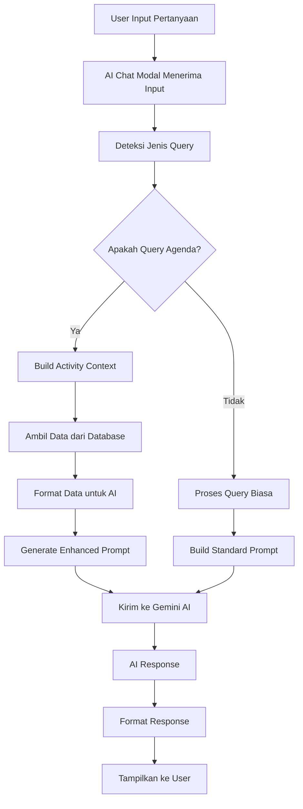

# Flow Alur AI Chat untuk Query Agenda - SAPA AI Platform

## Overview

Dokumen ini menjelaskan alur lengkap dari saat user bertanya tentang agenda/kegiatan hingga AI memberikan jawaban yang relevan berdasarkan data di database.

## 🔄 Alur Utama (Main Flow)



## 📋 Detail Alur Step-by-Step

### Step 1: User Input
**Lokasi:** [`AIChatModal.tsx`](src/components/AIChatModal.tsx:75)

User mengetik pertanyaan dalam bahasa Indonesia, contoh:
- "Apa saja kegiatan hari ini?"
- "Ada agenda besok?"
- "Tampilkan kegiatan minggu ini"
- "Apakah ada kegiatan terlambat?"

### Step 2: Deteksi Jenis Query
**Lokasi:** [`utils/aiActivityPrompts.ts`](utils/aiActivityPrompts.ts:65)

```typescript
const queryType = detectActivityQueryType(userInput);
```

**Logic Deteksi:**
- Cek keyword "hari ini" → `TODAY`
- Cek keyword "besok" → `TOMORROW`
- Cek keyword "minggu ini" → `THIS_WEEK`
- Cek keyword "minggu depan" → `NEXT_WEEK`
- Cek keyword "terlambat" → `OVERDUE`
- Cek keyword "statistik" → `STATISTICS`
- dll.

### Step 3: Context Building (Jika Query Agenda)
**Lokasi:** [`utils/aiActivityPrompts.ts`](utils/aiActivityPrompts.ts:12)

```typescript
const activityContext = await buildActivityContext(userId);
```

**Proses Context Building:**

#### 3.1 Parallel Data Fetching
```typescript
const [
  todayActivities,
  thisWeekActivities,
  nextWeekActivities,
  overdueActivities,
  statistics
] = await Promise.all([
  getTodayActivities(userId),
  getThisWeekActivities(userId),
  getNextWeekActivities(userId),
  getOverdueActivities(userId),
  getActivityStatistics(userId)
]);
```

#### 3.2 Database Queries
**Lokasi:** [`services/activityQueryService.ts`](services/activityQueryService.ts)

**Query Hari Ini:**
```sql
SELECT * FROM activities 
WHERE user_id = $1 
  AND DATE(tanggal_pelaksanaan) = CURRENT_DATE
ORDER BY tanggal_pelaksanaan;
```

**Query Minggu Ini:**
```sql
SELECT * FROM activities 
WHERE user_id = $1 
  AND tanggal_pelaksanaan >= start_of_week 
  AND tanggal_pelaksanaan <= end_of_week
ORDER BY tanggal_pelaksanaan;
```

**Query Overdue:**
```sql
SELECT * FROM activities 
WHERE user_id = $1 
  AND tanggal_pelaksanaan < CURRENT_DATE 
  AND status NOT IN ('Terbayar', 'Selesai')
ORDER BY tanggal_pelaksanaan;
```

#### 3.3 Data Formatting
**Lokasi:** [`services/activityQueryService.ts`](services/activityQueryService.ts:244)

```typescript
export function formatActivitiesForAI(activities: Activity[]): string {
  return activities.map((activity, index) => {
    const date = activity.tanggal_pelaksanaan 
      ? new Date(activity.tanggal_pelaksanaan).toLocaleDateString('id-ID', {
          weekday: 'long',
          year: 'numeric',
          month: 'long',
          day: 'numeric'
        })
      : 'Tanggal tidak ditentukan';
    
    const allocations = activity.allocations.length > 0
      ? `\n  Alokasi Anggaran:\n${activity.allocations.map(alloc => 
          `    - ${alloc.kode}: ${alloc.jumlah.toLocaleString('id-ID')} (${alloc.uraian})`
        ).join('\n')}`
      : '';
    
    return `${index + 1}. **${activity.nama}**
    - Status: ${activity.status || 'Tidak ditentukan'}
    - Tanggal: ${date}
    - Tujuan: ${activity.tujuan_kegiatan || 'Tidak ditentukan'}
    - Penanggung Jawab: ${activity.penanggung_jawab || 'Tidak ditentukan'}
    - Unit Terkait: ${activity.kl_unit_terkait || 'Tidak ditentukan'}
    - Capaian: ${activity.capaian || 'Belum ada capaian'}
    - Pending Issues: ${activity.pending_issue || 'Tidak ada'}${allocations}`;
  }).join('\n\n');
}
```

### Step 4: Enhanced Prompt Generation
**Lokasi:** [`utils/aiActivityPrompts.ts`](utils/aiActivityPrompts.ts:95)

```typescript
const enhancedPrompt = await createActivityEnhancedPrompt(
  baseSystemPrompt,
  userId,
  userInput
);
```

**Struktur Enhanced Prompt:**
```
Anda adalah asisten AI yang membantu analisis data anggaran di aplikasi internal.
Jawab dalam bahasa Indonesia yang ringkas, spesifik, dan berbasis data yang diberikan pengguna.
Jika tidak memiliki informasi yang cukup, jelaskan data apa yang dibutuhkan.

=== DATA KEGIATAN TERKINI ===

**Statistik Kegiatan:**
- Total Kegiatan: 15
- Status Rencana: 5
- Status Komitmen: 7
- Status Outstanding: 2
- Status Terbayar: 1
- Kegiatan Minggu Ini: 8
- Kegiatan Minggu Depan: 4
- Kegiatan Terlambat: 2

**KEGIATAN HARI INI (3 kegiatan):**

1. **Meeting Review Anggaran Q4**
   - Status: Komitmen
   - Tanggal: Senin, 28 Oktober 2025
   - Tujuan: Review realisasi anggaran kuartal ke-4
   - Penanggung Jawab: Budi Santoso
   - Unit Terkait: Direktorat Anggaran
   - Capaian: Belum ada capaian
   - Pending Issues: Tidak ada
   Alokasi Anggaran:
     - 1.01.01.01.01.01.123456: 50.000.000 (Meeting dan konsultasi)

=== AKHIR DATA KEGIATAN ===

**INSTRUKSI KHUSUS:**
Fokus pada kegiatan yang dijadwalkan untuk hari ini. Berikan informasi detail termasuk waktu, lokasi (jika ada), dan prioritas.

**PETUNJUK JAWABAN:**
- Jawab dalam bahasa Indonesia yang ringkas dan jelas
- Gunakan data kegiatan yang disediakan di atas
- Jika tidak ada data yang relevan, jelaskan bahwa tidak ada kegiatan yang sesuai
- Berikan saran atau rekomendasi jika diperlukan
- Format jawaban dengan bullet points atau numbering untuk kemudahan membaca

[Pertanyaan User: "Apa saja kegiatan hari ini?"]
```

### Step 5: AI Processing
**Lokasi:** [`services/aiService.ts`](services/aiService.ts:87)

```typescript
const aiReply = await fetchAiResponse(payload);
```

**Proses AI:**
1. **Payload Building** - Menggabungkan system prompt, context, dan pertanyaan user
2. **API Request** - Mengirim ke Google Gemini AI
3. **Response Processing** - Membersihkan dan memformat response
4. **Error Handling** - Fallback jika terjadi error

### Step 6: Response Formatting
**Lokasi:** [`src/components/AIChatModal.tsx`](src/components/AIChatModal.tsx:105)

```typescript
const cleanedReply = sanitizeOutput(aiReply);
```

**Proses Formatting:**
1. **Sanitization** - Remove harmful content
2. **HTML Formatting** - Convert markdown ke HTML
3. **Message Structure** - Tambahkan timestamp dan metadata
4. **UI Update** - Update chat interface

### Step 7: Display to User
**Lokasi:** [`src/components/AIChatModal.tsx`](src/components/AIChatModal.tsx:182)

Response ditampilkan dalam chat bubble dengan:
- **Avatar AI** - Icon asisten
- **Timestamp** - Waktu response
- **Formatted Content** - HTML dengan proper styling
- **Action Buttons** - Quick actions untuk follow-up

## 🎯 Contoh Spesifik Flow

### Scenario: User bertanya "Apa saja kegiatan hari ini?"

#### 1. Input Processing
```
User Input: "Apa saja kegiatan hari ini?"
Detected Query Type: "TODAY"
```

#### 2. Data Fetching
```typescript
// Parallel queries dieksekusi
const todayActivities = await getTodayActivities(userId);
// Result: 3 activities found
```

#### 3. Context Building
```
=== DATA KEGIATAN TERKINI ===

**Statistik Kegiatan:**
- Total Kegiatan: 15
- Kegiatan Hari Ini: 3

**KEGIATAN HARI INI (3 kegiatan):**
1. **Meeting Review Anggaran Q4**
   - Status: Komitmen
   - Tanggal: Senin, 28 Oktober 2025
   - Tujuan: Review realisasi anggaran kuartal ke-4
   - Penanggung Jawab: Budi Santoso
   - Unit Terkait: Direktorat Anggaran
   - Capaian: Belum ada capaian
   - Pending Issues: Tidak ada
   Alokasi Anggaran:
     - 1.01.01.01.01.01.123456: 50.000.000 (Meeting dan konsultasi)

2. **Workshop Penyusunan RKB**
   - Status: Rencana
   - Tanggal: Senin, 28 Oktober 2025
   - Tujuan: Penyusunan Rencana Kerja dan Anggaran
   - Penanggung Jawab: Siti Nurhaliza
   - Unit Terkait: Direktorat Perencanaan
   - Capaian: Belum ada capaian
   - Pending Issues: Tidak ada
   Alokasi Anggaran:
     - 1.01.01.01.01.01.01.234567: 75.000.000 (Workshop dan pelatihan)

3. **Monitoring Proyek X**
   - Status: Outstanding
   - Tanggal: Senin, 28 Oktober 2025
   - Tujuan: Monitoring progress proyek X
   - Penanggung Jawab: Ahmad Fauzi
   - Unit Terkait: Direktorat Proyek
   - Capaian: Progress 75%
   - Pending Issues: Kendala di supplier
   Alokasi Anggaran:
     - 1.01.01.01.01.01.01.345678: 100.000.000 (Monitoring dan evaluasi)

=== AKHIR DATA KEGIATAN ===
```

#### 4. Enhanced Prompt
```
**INSTRUKSI KHUSUS:**
Fokus pada kegiatan yang dijadwalkan untuk hari ini. Berikan informasi detail termasuk waktu, lokasi (jika ada), dan prioritas.
```

#### 5. AI Response
```
📅 **Ditemukan 3 kegiatan untuk hari ini.**

**Detail Kegiatan:**

1. **Meeting Review Anggaran Q4** (Status: Komitmen)
   - ⏰ Senin, 28 Oktober 2025
   - 👤 Budi Santoso (Direktorat Anggaran)
   - 🎯 Review realisasi anggaran kuartal ke-4
   - 💰 Rp 50.000.000 (Meeting dan konsultasi)
   - 📊 Capaian: Belum ada capaian

2. **Workshop Penyusunan RKB** (Status: Rencana)
   - ⏰ Senin, 28 Oktober 2025
   - 👤 Siti Nurhaliza (Direktorat Perencanaan)
   - 🎯 Penyusunan Rencana Kerja dan Anggaran
   - 💰 Rp 75.000.000 (Workshop dan pelatihan)
   - 📊 Capaian: Belum ada capaian

3. **Monitoring Proyek X** (Status: Outstanding)
   - ⏰ Senin, 28 Oktober 2025
   - 👤 Ahmad Fauzi (Direktorat Proyek)
   - 🎯 Monitoring progress proyek X
   - 💰 Rp 100.000.000 (Monitoring dan evaluasi)
   - 📊 Capaian: Progress 75%
   - ⚠️ Pending Issues: Kendala di supplier

**💡 Rekomendasi:**
- Prioritaskan Meeting Review Anggaran Q4 (status Komitmen)
- Follow up kendala supplier untuk Monitoring Proyek X
- Siapkan materi untuk Workshop Penyusunan RKB
```

## 🚀 Performance Optimizations

### 1. Parallel Data Fetching
```typescript
// Semua query dieksekusi paralel untuk mengurangi latency
const [today, week, overdue, stats] = await Promise.all([...]);
```

### 2. Smart Caching
```typescript
// Cache hasil query untuk 5 menit
const cacheKey = `activities_${userId}_${dateRange}`;
if (cache.has(cacheKey)) return cache.get(cacheKey);
```

### 3. Context Size Management
```typescript
// Batasi context untuk prevent token overflow
if (activities.length > 10) {
  activities = activities.slice(0, 10);
  context += '\n\n*Menampilkan 10 kegiatan teratas dari total X kegiatan*';
}
```

## 🔒 Security & Privacy

### 1. User Isolation
```typescript
// Hanya data user yang diakses
.eq('user_id', userId)
```

### 2. Data Sanitization
```typescript
// Sanitasi input dan output
const sanitizedInput = sanitizeUserInput(userInput);
const sanitizedOutput = sanitizeA IResponse(aiResponse);
```

### 3. Audit Logging
```typescript
// Log semua AI queries untuk monitoring
await logAIQuery(userId, userInput, queryType, response);
```

## 🎉 User Experience Features

### 1. Quick Prompts
6 tombol cepat dengan icons untuk query umum:
- 📅 Agenda Hari Ini
- 📋 Kegiatan Minggu Ini
- ⚠️ Kegiatan Terlambat
- 📊 Statistik Kegiatan
- 🎯 Prioritas Minggu Depan
- 📝 Ringkasan Bulanan

### 2. Real-time Updates
- Auto-refresh data setiap 5 menit
- Manual refresh dengan pull-to-refresh
- Indikator data freshness

### 3. Progressive Loading
- Loading skeleton saat fetch data
- Incremental rendering untuk large datasets
- Smooth animations dan transitions

## 📈 Monitoring & Analytics

### 1. Performance Metrics
- Query response time
- AI processing time
- Database query performance
- User interaction patterns

### 2. Usage Analytics
- Most common query types
- Peak usage times
- Error rates dan types
- User satisfaction scores

## 🔄 Error Handling & Recovery

### 1. Graceful Degradation
```typescript
if (databaseError) {
  return 'Maaf, tidak dapat mengakses data kegiatan saat ini. Silakan coba lagi nanti.';
}

if (aiError) {
  return 'Maaf, terjadi kesalahan saat memproses permintaan. Silakan coba lagi.';
}
```

### 2. Fallback Mechanisms
- Standard AI response tanpa context
- Cached responses untuk common queries
- Manual activity list view
- Alternative search methods

## Kesimpulan

Flow alur AI Chat untuk query agenda dirancang untuk memberikan pengalaman yang:

1. **Natural & Intuitive** - User dapat bertanya dalam bahasa Indonesia alami
2. **Fast & Responsive** - Parallel processing dan smart caching
3. **Context-Aware** - AI memahami konteks lengkap kegiatan user
4. **Rich & Informative** - Response detail dengan formatting yang mudah dibaca
5. **Secure & Private** - Proper access control dan data protection
6. **Scalable & Reliable** - Error handling dan performance optimization

Sistem ini secara signifikan meningkatkan produktivitas user dalam mengakses dan mengelola data kegiatan melalui interface AI yang cerdas dan responsif.