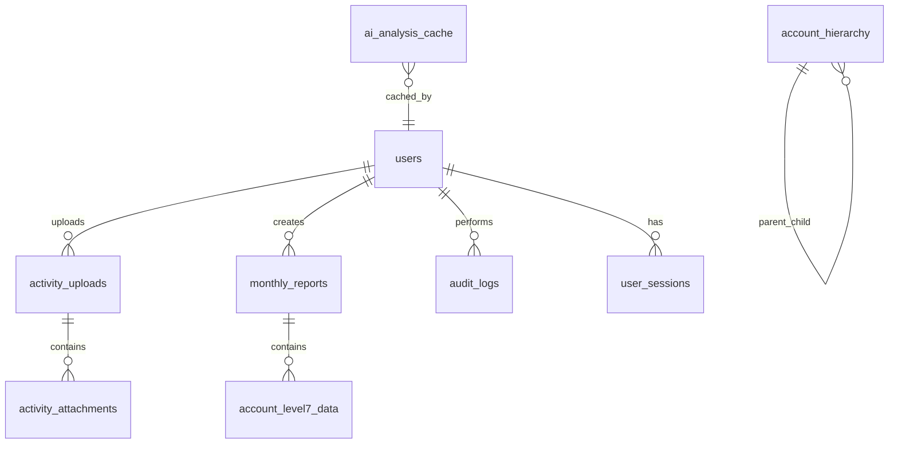
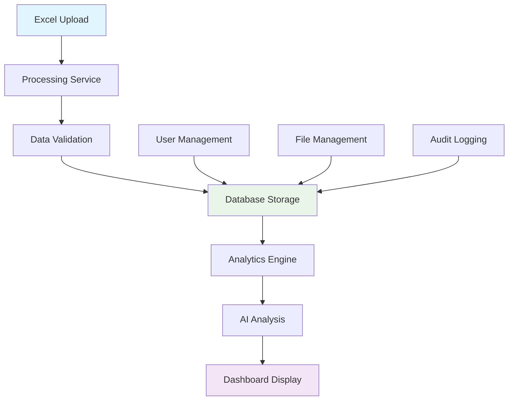

# 🧠 SAPA AI - Smart Analytics Platform

Platform web terintegrasi AI untuk processing data Excel, analisis cerdas, dan manajemen dokumen dengan kemampuan machine learning.

## 📋 Repository Information

**Note**: Repository name (`excel-data-processor`) maintains backward compatibility, 
while application has been rebranded to "SAPA AI - Smart Analytics Platform".

**Package Name**: `sapa-ai-platform`
**Application Name**: SAPA AI
**Repository**: excel-data-processor (for compatibility)

## 🚀 Quick Start

### Prerequisites
- **Node.js** (v18+)
- **npm** atau **yarn**

### 🛠️ Installation & Setup

1. **Clone Repository**
   ```bash
   git clone <repository-url>
   cd excel-data-processor
   ```

2. **Install Dependencies**
   ```bash
   npm install
   ```

3. **Setup Environment Variables**
   ```bash
   # Copy template environment file
   cp .env.example .env
   
   # Edit .env file dengan konfigurasi Anda:
   nano .env  # atau gunakan editor favorit Anda
   ```

4. **Konfigurasi Wajib di `.env`**
   ```bash
   # Supabase Configuration (dari dashboard Supabase)
   VITE_SUPABASE_URL=https://your-project.supabase.co
   VITE_SUPABASE_ANON_KEY=your-anon-key-here
   SUPABASE_SERVICE_ROLE_KEY=your-service-role-key-here
   
   # Gemini AI Configuration (dari Google AI Studio)
   GEMINI_API_KEY=your-gemini-api-key-here
   
   # Security (generate strong string untuk production)
   JWT_SECRET=your-super-secret-jwt-key-here
   
   # Admin Emails (opsional, auto-approved)
   ADMIN_EMAILS=admin@company.com,manager@company.com
   ```

5. **Run Development Server**
   ```bash
   npm run dev
   ```

   Aplikasi akan berjalan di:
   - 🌐 **Frontend**: http://localhost:5173
   - 🔐 **Auth API**: http://localhost:3002
   - 📁 **File Upload API**: http://localhost:3001

## 🏗️ Project Structure

```
excel-data-processor/
├── 📁 src/                    # Frontend React application
│   ├── components/              # React components
│   ├── pages/                  # Page components
│   ├── contexts/               # React contexts
│   ├── hooks/                  # Custom hooks
│   ├── config/                 # Configuration files
│   └── utils/                 # Utility functions
├── 📁 server/                 # Backend services
│   ├── auth-server.js          # Authentication & user management
│   └── activity-upload-server.js # File upload handling
├── 📁 services/               # Business logic services
├── 📁 scripts/                # Utility scripts
├── 📁 bahanUpload/            # Upload directory (development)
├── 📄 .env.example           # Environment template
├── 📄 .env                   # Actual environment (ignored by Git)
├── 📄 ecosystem.config.cjs    # PM2 production config
└── 📄 CONFIG_GUIDE.md         # Detailed configuration guide
```

## 🔧 Available Scripts

### Development
```bash
npm run dev          # Start all development servers
npm run dev:client   # Frontend only
npm run api          # Activity upload server only
npm run auth         # Auth server only
```

### Production
```bash
npm run build        # Build for production
npm run start        # Start with PM2
npm run stop         # Stop PM2 processes
```

### Utilities
```bash
npm run lint         # Run ESLint
npm run lint:fix     # Fix ESLint issues
npm run format       # Format code with Prettier
npm run validate     # Run lint + format check
```

### Management
```bash
npm run pm2:status   # Check PM2 status
npm run pm2:logs     # View PM2 logs
npm run pm2:restart  # Restart PM2 processes
npm run create-admin  # Create admin user script
npm run check-env     # Validate environment variables
```

## 🔧 Configuration

### Environment Variables

Lihat `CONFIG_GUIDE.md` untuk panduan lengkap konfigurasi.

**Kategori Konfigurasi:**
- 🔧 **Server Configuration**: Ports, hosts, environment
- 🔐 **Authentication**: JWT, cookies, admin emails
- 🌐 **API & URLs**: Supabase, auth server, CORS
- 🤖 **AI Configuration**: Gemini API settings
- 📁 **File Upload**: Size limits, allowed types

### Port Configuration

Default ports yang digunakan:
| Service | Port | Environment Variable |
|---------|-------|---------------------|
| Frontend | 5173 | `FRONTEND_PORT` |
| Auth API | 3002 | `AUTH_SERVER_PORT` |
| File Upload API | 3001 | `ACTIVITY_SERVER_PORT` |

## 🗄️ Database Schema

### Supabase Database Structure

Platform SAPA AI menggunakan Supabase sebagai backend database dengan struktur tabel berikut:

#### 🔐 **Authentication Tables**
```sql
-- Users table (managed by Supabase Auth)
users (
  id: uuid (primary key)
  email: text (unique)
  role: text (admin/user)
  created_at: timestamp
  updated_at: timestamp
)
```

#### 📁 **File Management Tables**
```sql
-- Activity uploads tracking
activity_uploads (
  id: uuid (primary key)
  filename: text
  original_name: text
  file_path: text
  file_size: integer
  mime_type: text
  uploaded_by: uuid (foreign key to users.id)
  upload_date: timestamp
  processed: boolean
  metadata: jsonb
)

-- File attachments metadata
activity_attachments (
  id: uuid (primary key)
  upload_id: uuid (foreign key to activity_uploads.id)
  attachment_type: text (pdf/document/image)
  attachment_path: text
  metadata: jsonb
  created_at: timestamp
)
```

#### 📊 **Data Analytics Tables**
```sql
-- Historical data storage
monthly_reports (
  id: uuid (primary key)
  report_date: date
  report_type: text
  total_pagu: bigint
  total_realisasi: bigint
  persentase: decimal
  created_by: uuid (foreign key to users.id)
  created_at: timestamp
  updated_at: timestamp
)

-- Account level 7 data for detailed analytics
account_level7_data (
  id: uuid (primary key)
  report_id: uuid (foreign key to monthly_reports.id)
  kode: text
  uraian: text
  pagu: bigint
  realisasi: bigint
  persentase: decimal
  sisa: bigint
  level: integer
  created_at: timestamp
)

-- Hierarchical account structure
account_hierarchy (
  id: uuid (primary key)
  parent_id: uuid (foreign key to account_hierarchy.id)
  kode: text
  uraian: text
  level: integer
  is_active: boolean
  created_at: timestamp
  updated_at: timestamp
)
```

#### 🤖 **AI & Analytics Tables**
```sql
-- AI analysis cache
ai_analysis_cache (
  id: uuid (primary key)
  analysis_type: text (monthly/trend/comparison)
  input_data_hash: text (unique)
  analysis_result: jsonb
  model_used: text
  created_at: timestamp
  expires_at: timestamp
)

-- User sessions and preferences
user_sessions (
  id: uuid (primary key)
  user_id: uuid (foreign key to users.id)
  session_data: jsonb
  last_activity: timestamp
  created_at: timestamp
)

-- Audit trail for compliance
audit_logs (
  id: uuid (primary key)
  user_id: uuid (foreign key to users.id)
  action: text
  resource: text
  old_values: jsonb
  new_values: jsonb
  ip_address: text
  user_agent: text
  created_at: timestamp
)
```

### 🔍 **Key Relationships**



### 📊 **Data Flow Architecture**



### 🔧 **Database Configuration**

#### **Environment Setup**
```bash
# Supabase Configuration
VITE_SUPABASE_URL=https://your-project.supabase.co
VITE_SUPABASE_ANON_KEY=your-anon-key-here
SUPABASE_SERVICE_ROLE_KEY=your-service-role-key-here
```

#### **Required Supabase Extensions**
- **pgcrypto** - Untuk enkripsi data sensitif
- **uuid-ossp** - Untuk UUID generation
- **btree_gin** - Untuk JSON indexing
- **pg_trgm** - Untuk text search

#### **Indexing Strategy**
```sql
-- Performance indexes
CREATE INDEX idx_monthly_reports_date ON monthly_reports(report_date DESC);
CREATE INDEX idx_account_level7_kode ON account_level7_data(kode);
CREATE INDEX idx_activity_uploads_user ON activity_uploads(uploaded_by);
CREATE INDEX idx_audit_logs_user_date ON audit_logs(user_id, created_at DESC);
CREATE INDEX idx_ai_cache_hash ON ai_analysis_cache(input_data_hash);
```

### 🔄 **Data Migration & Seeding**

#### **Initial Setup**
```bash
# Run database migrations
npm run db:migrate

# Seed initial data (admin users, default hierarchy)
npm run db:seed

# Verify database setup
npm run db:verify
```

## 🚀 Production Deployment

### Using PM2 (Recommended)

1. **Setup Production Environment**
   ```bash
   # Copy dan edit production environment
   cp .env.example .env.production
   
   # Edit dengan production values
   NODE_ENV=production
   COOKIE_SECURE=true
   CORS_ORIGIN=https://yourdomain.com
   ```

2. **Build & Deploy**
   ```bash
   npm run build
   npm run start
   ```

3. **Monitor Deployment**
   ```bash
   npm run pm2:status
   npm run pm2:logs
   ```

### Manual Deployment

```bash
# Build frontend
npm run build

# Start servers manually
NODE_ENV=production node server/auth-server.js &
NODE_ENV=production node server/activity-upload-server.js &
serve -s dist -l 5173
```

## 🔍 Development Tips

### Common Issues & Solutions

1. **Port Conflicts**
   ```bash
   # Ubah port di .env
   AUTH_SERVER_PORT=3003
   ACTIVITY_SERVER_PORT=3004
   ```

2. **CORS Issues**
   ```bash
   # Tambahkan origin ke CORS_ORIGIN
   CORS_ORIGIN=http://localhost:5173,http://127.0.0.1:5173,http://192.168.1.100:5173
   ```

3. **Environment Issues**
   ```bash
   # Validasi environment variables
   npm run check-env
   ```

### Development Workflow

1. **Feature Development**
   ```bash
   # Create feature branch
   git checkout -b feature/new-feature
   
   # Develop with hot reload
   npm run dev
   
   # Test changes
   # Lint & format
   npm run validate
   ```

2. **Before Commit**
   ```bash
   # Run all checks
   npm run validate
   
   # Add changes
   git add .
   git commit -m "feat: add new feature"
   ```

## 🤝 Contributing

1. Fork repository
2. Create feature branch (`git checkout -b feature/amazing-feature`)
3. Commit changes (`git commit -m 'Add amazing feature'`)
4. Push to branch (`git push origin feature/amazing-feature`)
5. Open Pull Request

## 📝 Documentation

- **`CONFIG_GUIDE.md`** - Panduan konfigurasi lengkap
- **`Rangkuman_proyek.md`** - Overview teknis proyek
- **`dokumentasi.md`** - Documentation detail

## 🐛 Troubleshooting

### Getting Help

Jika mengalami masalah:

1. **Check Environment**
   ```bash
   npm run check-env
   ```

2. **Check Logs**
   ```bash
   # Development logs
   npm run dev
   
   # Production logs
   npm run pm2:logs
   ```

3. **Reset Configuration**
   ```bash
   # Reset ke default
   cp .env.example .env
   ```

4. **Clear Cache**
   ```bash
   # Clear node modules
   rm -rf node_modules package-lock.json
   npm install
   ```

## 📄 License

[MIT License](LICENSE)

## 👥 Team

- Development Team
- System Architecture
- DevOps & Deployment

---

**🎉 Happy Coding!**

Untuk pertanyaan atau bantuan tambahan, lihat `CONFIG_GUIDE.md` atau buka issue di repository.
