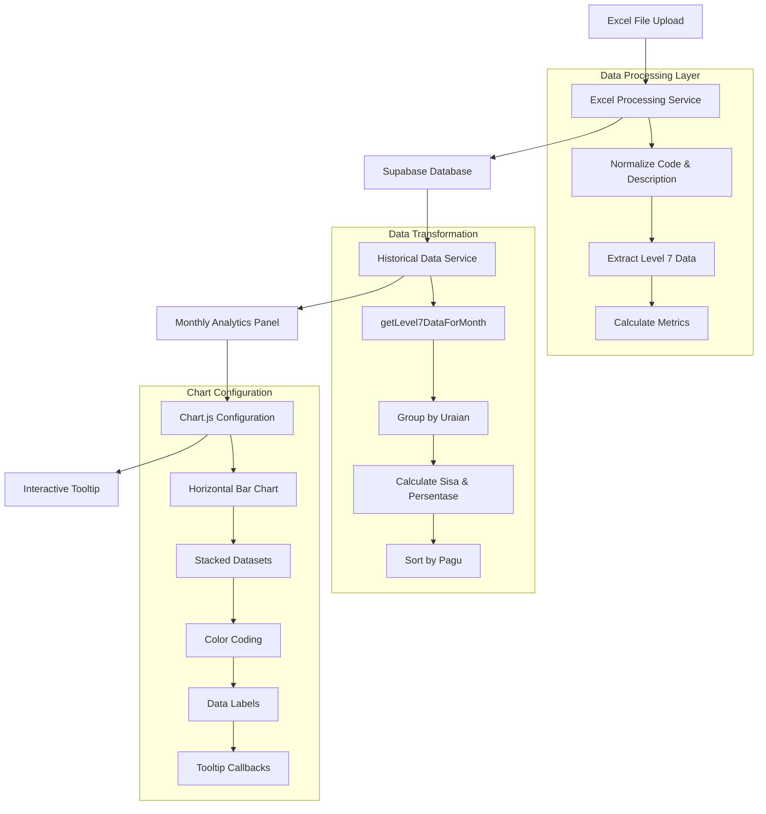
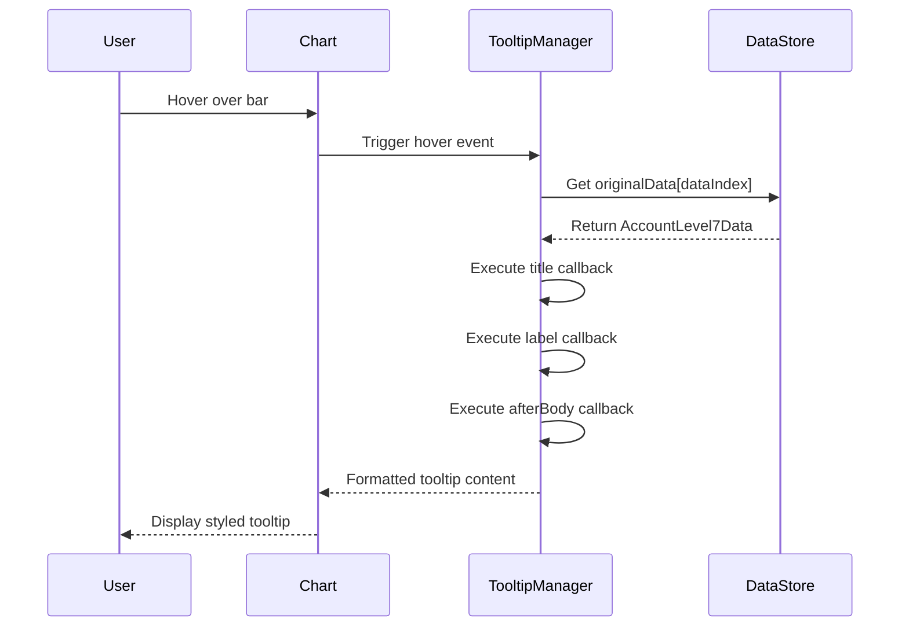

# Proses Chart Penyerapan Anggaran per Uraian hingga Tooltip Interaktif

## Overview

Dokumen ini menjelaskan proses lengkap dari data mentah hingga munculnya Chart Penyerapan Anggaran per Uraian dan tooltip interaktif saat mouse hover di komponen `MonthlyAnalyticsPanel.tsx`.

## Alur Data Lengkap



## 1. Sumber Data

### 1.1 Excel File Upload
- File Excel diunggah melalui sistem
- Diproses oleh [`excelProcessor.ts`](services/excelProcessor.ts)
- Data disimpan ke tabel `processed_results` di Supabase

### 1.2 Struktur Data Mentah
```typescript
// Excel row structure
[
  kode: string,        // WA.6336.EBA.963.126.0B.521211.002523
  uraian: string,     // Belanja Modal
  pagu: number,       // 1000000000
  // ... kolom lainnya
  realisasi: number   // 750000000
]
```

## 2. Proses Normalisasi Data

### 2.1 Normalisasi Kode dan Deskripsi
Fungsi: [`normalizeCodeAndDescription()`](utils/dataNormalization.ts:24)

```typescript
// Extract 6-digit code from description
const DESCRIPTION_PREFIX_REGEX = /^(\d{6})\.\s*(.+)$/;

// Process: "123456. Belanja Modal" -> 
// - kode: "WA.6336.EBA.963.126.0B.521211.002523.123456"
// - uraian: "Belanja Modal"
```

### 2.2 Ekstraksi Data Level 7
Fungsi: [`extractLevel7Data()`](services/historicalDataService.ts:92)

```typescript
export interface AccountLevel7Data {
  kode: string;        // Level 7 code (segment terakhir)
  kodeLengkap?: string; // Full code
  uraian: string;      // Description
  pagu: number;        // Budget allocation
  realisasi: number;   // Realization
  persentase: number;  // Percentage
  sisa: number;        // Remaining budget
}
```

**Proses Filter:**
- Hanya baris dengan 8 segments (Level 7)
- Extract level 7 code (segment terakhir)
- Hitung persentase dan sisa anggaran

## 3. Transformasi Data untuk Chart

### 3.1 Pengambilan Data Bulanan
Fungsi: [`getLevel7DataForMonth()`](services/historicalDataService.ts:130)

```typescript
// Dari MonthlyReport -> AccountLevel7Data[]
const currentMonthData = useMemo(() => {
  if (!currentReport) return [];
  return getLevel7DataForMonth(currentReport);
}, [currentReport]);
```

### 3.2 Agregasi per Uraian
Fungsi: [`sisaAnggaranTerbanyak`](src/components/dashboard/MonthlyAnalyticsPanel.tsx:128)

```typescript
// Group by uraian dan agregasi nilainya
const groupedByUraian = new Map<string, {
  uraian: string;
  pagu: number;
  realisasi: number;
  sisa: number;
  persentase: number;
}>();

currentMonthData.forEach(item => {
  const existing = groupedByUraian.get(item.uraian);
  if (existing) {
    existing.pagu += item.pagu;
    existing.realisasi += item.realisasi;
  } else {
    groupedByUraian.set(item.uraian, {
      uraian: item.uraian,
      pagu: item.pagu,
      realisasi: item.realisasi,
      sisa: 0,
      persentase: 0,
    });
  }
});
```

### 3.3 Kalkulasi Metrik
```typescript
// Hitung sisa dan persentase
return Array.from(groupedByUraian.values())
  .map(item => {
    const sisa = item.pagu - item.realisasi;
    const persentase = item.pagu > 0 ? (item.realisasi / item.pagu) * 100 : 0;
    return {
      ...item,
      sisa: sisa > 0 ? sisa : 0,
      persentase,
    };
  })
  .filter(item => item.pagu > 0)
  .sort((a, b) => b.pagu - a.pagu);
```

## 4. Konfigurasi Chart

### 4.1 Struktur Data Chart
Fungsi: [`anggaranChartData`](src/components/dashboard/MonthlyAnalyticsPanel.tsx:472)

```typescript
const anggaranChartData = useMemo(() => {
  // Color coding based on percentage
  const getHealthColor = (percentage: number) => {
    if (percentage >= 75) return '#10B981'; // Green - Sehat
    if (percentage >= 50) return '#F59E0B'; // Yellow - Warning
    return '#EF4444'; // Red - Kritis
  };

  return {
    labels: anggaranPerUraian.map(item => item.uraian),
    datasets: [
      {
        label: 'Realisasi',
        data: anggaranPerUraian.map(item => item.realisasi),
        backgroundColor: anggaranPerUraian.map(item => getHealthColorLight(item.persentase)),
        borderColor: anggaranPerUraian.map(item => getHealthColor(item.persentase)),
        borderWidth: 2,
        borderRadius: 8,
        maxBarThickness: 32,
      },
      {
        label: 'Sisa',
        data: anggaranPerUraian.map(item => item.sisa),
        backgroundColor: '#E5E7EB',
        borderColor: '#9CA3AF',
        borderWidth: 2,
        borderRadius: 0,
        maxBarThickness: 32,
      }
    ],
    // Store original data for tooltip calculations
    originalData: anggaranPerUraian,
  };
}, [anggaranPerUraian]);
```

### 4.2 Opsi Chart
Fungsi: [`anggaranChartOptions`](src/components/dashboard/MonthlyAnalyticsPanel.tsx:545)

```typescript
const anggaranChartOptions = useMemo(() => {
  return {
    indexAxis: 'y' as const, // Horizontal bar chart
    responsive: true,
    maintainAspectRatio: false,
    scales: {
      x: {
        stacked: true, // Stacked bar (realisasi + sisa)
        beginAtZero: true,
        ticks: {
          callback: (value: any) => formatToShortCurrency(value),
        },
      },
      y: {
        stacked: true,
        ticks: {
          callback: (_value: any, index: number) => {
            return anggaranPerUraian[index]?.uraian || '';
          },
          autoSkip: false, // Show all labels
        },
      },
    },
    plugins: {
      legend: {
        position: 'top' as const,
      },
      tooltip: {
        // Tooltip configuration - see section 5
      },
    },
  };
}, [anggaranPerUraian]);
```

## 5. Implementasi Tooltip Interaktif

### 5.1 Konfigurasi Tooltip
```typescript
tooltip: {
  enabled: true,
  backgroundColor: 'rgba(17, 24, 39, 0.95)',
  titleColor: '#FFFFFF',
  bodyColor: '#E5E7EB',
  borderColor: '#374151',
  borderWidth: 1,
  padding: 12,
  cornerRadius: 8,
  displayColors: true,
  callbacks: {
    // Custom title dengan status kesehatan
    title: (items: any[]) => {
      const firstItem = items[0];
      const original = firstItem?.chart?.data?.originalData?.[firstItem.dataIndex] || null;
      return original
        ? {
            label: original.uraian,
            health: original.persentase >= 75
              ? '🟢 Sehat'
              : original.persentase >= 50
                ? '🟡 Perhatian'
                : '🔴 Kritis',
          }
        : '';
    },
    
    // Label untuk setiap dataset
    label: (context: any) => {
      const label = context.dataset.label || '';
      const value = context.parsed.x;
      if (label === 'Realisasi') {
        return `Realisasi: Rp ${value.toLocaleString('id-ID')}`;
      }
      return `Sisa: Rp ${value.toLocaleString('id-ID')}`;
    },
    
    // Additional info after body
    afterBody: (items: any[]) => {
      const firstItem = items[0];
      const original = firstItem?.chart?.data?.originalData?.[firstItem.dataIndex] || null;
      if (!original) return [];
      
      const persentase = original.pagu > 0 ? (original.realisasi / original.pagu) * 100 : 0;
      const healthStatus = persentase >= 75
        ? 'Sehat (≥75%)'
        : persentase >= 50
          ? 'Perhatian (50-74%)'
          : 'Kritis (<50%)';
          
      return [
        '',
        `📊 Total Pagu: Rp ${original.pagu.toLocaleString('id-ID')}`,
        `💰 Total Realisasi: Rp ${original.realisasi.toLocaleString('id-ID')}`,
        `💸 Sisa Anggaran: Rp ${original.sisa.toLocaleString('id-ID')}`,
        `📈 Persentase: ${persentase.toFixed(1)}%`,
        `🏥 Status: ${healthStatus}`,
      ];
    },
  },
}
```

### 5.2 Proses Tooltip saat Mouse Hover

1. **Mouse Hover Detection**: Chart.js mendeteksi hover pada bar element
2. **Context Retrieval**: Mengambil context dari chart data
3. **Original Data Access**: Mengakses `originalData` yang disimpan dalam chart configuration
4. **Dynamic Content Generation**: Callback functions menghasilkan konten tooltip
5. **Rendering**: Tooltip ditampilkan dengan formatting dan styling kustom

### 5.3 Flow Detail Tooltip



## 6. Komponen Visual

### 6.1 Indikator Kesehatan
- 🟢 **Sehat (≥75%)**: Penyerapan anggaran baik
- 🟡 **Perhatian (50-74%)**: Perlu peningkatan
- 🔴 **Kritis (<50%)**: Butuh perhatian serius

### 6.2 Summary Statistics
```typescript
// Count by health status
const healthyCount = anggaranPerUraian.filter(item => item.persentase >= 75).length;
const warningCount = anggaranPerUraian.filter(item => item.persentase >= 50 && item.persentase < 75).length;
const criticalCount = anggaranPerUraian.filter(item => item.persentase < 50).length;
```

## 7. Teknologi yang Digunakan

- **React**: Component framework
- **Chart.js**: Chart library
- **react-chartjs-2**: React wrapper untuk Chart.js
- **chartjs-plugin-datalabels**: Plugin untuk data labels
- **Supabase**: Database backend
- **TypeScript**: Type safety

## 8. Key Features

1. **Real-time Data Processing**: Data diproses langsung dari database
2. **Dynamic Color Coding**: Warna berdasarkan persentase penyerapan
3. **Interactive Tooltips**: Informasi lengkap saat hover
4. **Responsive Design**: Menyesuaikan ukuran layar
5. **Stacked Bar Chart**: Menampilkan realisasi dan sisa anggaran
6. **Custom Formatting**: Format mata uang Indonesia

## 9. Performance Optimizations

- **useMemo**: Memoization untuk data processing
- **Lazy Loading**: Chart hanya render saat diperlukan
- **Data Filtering**: Hanya proses data yang relevan
- **Efficient Sorting**: Sort by pagu (descending) untuk prioritas

## 10. Error Handling

- Graceful fallback untuk missing data
- Null checks untuk semua data access
- Default values untuk calculations
- Empty state handling

---

*Proses ini memastikan data dari Excel file mentah ditransformasi menjadi visualisasi yang informatif dan interaktif dengan tooltip yang memberikan insight lengkap tentang penyerapan anggaran per uraian.*